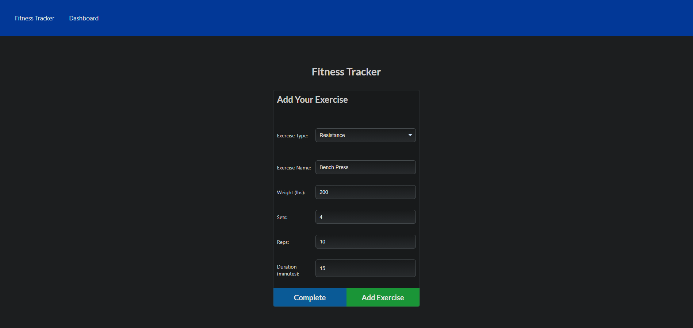

# Workout Tracker   
People looking to get and stay in shape are more likely to do so if they have a way to keep track of their progress. This application is meant to provide users with a way to track their workouts. 

This application provided a valuable learning experience in the use of MongDB, Mongoose data modeling, Express integration to Mongo and Mongoose, and Heroku deployment with MongoDB Atlas.

## Installation

This is a web application and thus requires no installation.

## Usage

To use this application navigat in your browser to 
https://gls-workout-tracker.herokuapp.com/

On the home page click the 'New Workout' button and input your workout details. To view your workouts click on the 'Dashboard' link in the top left part of the screen. To return to the home page click on the link named 'Fitness Tracker' on the top left part of the screen. 

## License

MIT
